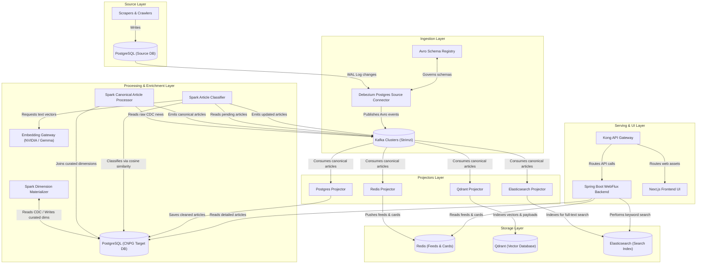

# Imperium News Streaming Platform

## Executive Overview

The **Imperium News Streaming Platform** is an enterprise real-time, event-driven intelligence system designed for high-throughput news ingestion, enrichment, multi-engine indexing, and low-latency serving. The system transitions an operational news intelligence ecosystem from a legacy, database-centric CRUD architecture to a stream-processing topology capable of processing high-frequency writes from web scrapers while maintaining client feed serving latencies within **50–500ms**.

### Problem Statement: Legacy vs. Modern Architecture

In the legacy architecture, PostgreSQL functioned as a monolithic system of record and query engine. It was concurrently responsible for accepting high-throughput inserts from scraping workers, running periodic batch SQL scripts for normalization, and executing complex relational queries and joins for client feeds.

This monolithic pattern caused significant operational bottlenecks:
- **Database Contention:** High-write lock contention from scraping microservices degraded read performance for user-facing feed queries.
- **High Latency:** Multi-table relational joins across millions of article records resulted in response times of several seconds under moderate query loads.
- **Lack of Real-Time Availability:** Batch-scheduled category resolution meant newly scraped news items were delayed before appearing on user feeds.
- **Absence of Semantic Search:** Keyword-only queries failed to capture conceptual context or thematic similarity.

The modernized architecture resolves these limitations by decoupling write ingestion, stream processing, vector embeddings, and serving indexes through Change Data Capture (CDC), Apache Kafka, Apache Spark Structured Streaming, and specialized storage engines.

---

## Architectural Principles and Design Patterns

### Command Query Responsibility Segregation (CQRS)
- **Command Path (Writes):** Ingestion scrapers write raw records exclusively to the source relational database.
- **Query Path (Reads):** Client APIs query read-optimized projection stores (Redis for feeds, Qdrant for semantic vector search, and Elasticsearch for full-text search) instead of executing relational joins on the transactional database.

### Event Sourcing via Change Data Capture (CDC)
- Database modifications (INSERT, UPDATE, DELETE) in PostgreSQL are captured at the Write-Ahead Log (WAL) layer using Debezium logical decoding (`pgoutput`).
- Changes are transformed into binary Avro events and appended to Kafka topics, establishing an immutable, replay-safe event log as the single source of truth.

### Decoupled Serving Projectors Pattern
- Stream processing jobs emit a standardized event contract (**Canonical Article**) to Kafka topics.
- Autonomous Python worker processes (**Projectors**) consume canonical events asynchronously and populate their target serving stores (PostgreSQL, Redis, Qdrant, Elasticsearch).
- This decouples storage writes: an operational failure or performance degradation in one engine (e.g., Qdrant) does not impact core stream processing or Redis feed serving.

### Multi-Engine Storage Architecture
- **PostgreSQL (System of Record):** Provides long-term transactional durability for cleaned articles, reference dimensions, and topic taxonomy structures (managed via CloudNativePG).
- **Redis (In-Memory Feed Store):** Serves global, country-specific, and topic feeds via Sorted Sets (ZSETs) and Feed Card Hashes with a 10-day sliding retention window.
- **Qdrant (Vector Database):** Stores 3584-dimensional embeddings for cosine similarity retrieval and payload-filtered semantic search.
- **Elasticsearch (Search Index):** Executes keyword search and full-text filtering with multi-lingual text analyzers.

### Feed V3 Timestamp-Window Scanner
- Replaces legacy list-scanning operations with an O(1) **Read Intervals** tuple scanner (`[[startTs, endTs], ...]`).
- Evaluates feed requests backward in 4-hour window steps. Time windows fully covered by a user's read history are skipped instantly without calling Redis, guaranteeing constant response times regardless of total read history size.

---

## High-Level System Architecture



---

## Data Pipeline Lifecycle

1. **Ingestion:** Raw news articles inserted into PostgreSQL trigger Write-Ahead Log (WAL) entries. Debezium captures log updates and publishes Avro-encoded events to raw Kafka topics.
2. **Dimension Materialization:** Spark Structured Streaming processes raw reference CDC streams (`table_links`, `table_pays`, etc.) and materializes curated PostgreSQL dimension tables.
3. **Canonical Processing:** Spark article processor consumes raw news events, resolves country metadata via hierarchical fallback logic, strips HTML formatting, generates a 30-word display excerpt, and emits a Canonical Article event (`classification_status = pending`).
4. **Classification & Vectorization:** Spark classifier calls the internal Embedding Gateway to generate dense 3584-dimension vectors (NVIDIA BGE-M3 model, with local `llama-cpp` Gemma-2B fallback). Spark calculates cosine similarity against precomputed topic vectors, updates category metadata (`classification_status = classified`), and emits the updated event back to Kafka.
5. **Asynchronous Projection:** Independent Python projectors update Redis feed ZSETs and HASH cards, index vector payloads in Qdrant, index documents in Elasticsearch, and persist durable clean records in PostgreSQL.
6. **Reactive Serving:** Spring Boot WebFlux serving layer processes incoming user requests asynchronously, returning feeds from Redis memory, full-text search results from Elasticsearch, and full article details from PostgreSQL.

---

## Technical Stack & Component Breakdown

### 1. Ingestion Layer
- **Engine:** Debezium Postgres Source Connector running on Kafka Connect.
- **Schema Governance:** Apache Avro format governed by Confluent Schema Registry with Backward Compatibility enforcement.
- **Ordering Guarantees:** Single-writer WAL slot, message keying on primary key, and `max.in.flight.requests.per.connection = 1` to ensure strict per-partition event ordering.

### 2. Processing & Enrichment Layer
- **Framework:** Apache Spark 3.5.3 (Structured Streaming) managed via Spark Operator.
- **Embedding Gateway:** Internal proxy enforcing rate limits (40 RPM), token batching (up to 8191 tokens per request), exponential backoff retries, and local Gemma-2B fallback.
- **Classifier:** Cosine similarity engine comparing normalized article vectors against PostgreSQL-stored topic embeddings.

### 3. Serving & Backend Layer
- **Framework:** Spring Boot 3 + Spring WebFlux (Project Reactor, Netty event loop).
- **Reactive Drivers:** R2DBC (PostgreSQL), Reactive Redis Template, WebClient (Elasticsearch).
- **Feed Engine:** Feed V3 Timestamp-Window Scanner implementing 5 execution phases (New Item Injection, Buffer Drain, Older Window Scan with O(1) Read Interval skips, Hydration, and Atomic Commit).

### 4. Frontend Application
- **Framework:** Next.js 15 (App Router) + React 19.
- **Design System:** Tailwind CSS v4 + Motion (Framer Motion) implementing an Editorial Paper Aesthetic (Playfair Display serif headlines, Inter/Outfit body typography, custom color tokens).
- **State Management:** Zustand stores for preferences, sessions, and client bookmark states.

### 5. Infrastructure & Operations
- **Orchestration:** K3s lightweight Kubernetes (3-node topology).
- **Packaging:** Helm Umbrella Chart (`imperium-streaming-news-processing`).
- **Operators:** Strimzi Kafka Operator, CloudNativePG Operator, Spark Operator, Kong Gateway Operator.
- **Observability:** OpenTelemetry Collector pipeline exporting M.E.L.T. (Metrics, Events, Logs, Traces) to ClickHouse OLAP storage, visualized through HyperDX dashboards.
- **CI/CD & GitOps:** Jenkins CI (dynamic Kubernetes build agents, SSH deploy key integration) coupled with ArgoCD GitOps (automated reconciliation, self-healing, and drift pruning).

---

## Domain Ubiquitous Language

- **Raw News Record:** A source PostgreSQL news row captured via CDC prior to cleaning or enrichment.
- **Canonical Article:** The primary boundary event contract emitted by stream processing and consumed by serving projectors.
- **Cleaned Article:** The durable, fully enriched PostgreSQL record stored after processing.
- **Article ID:** The deterministic platform identifier formatted as `news:{source_news_id}`.
- **Excerpt:** A deterministic 30-word text snippet derived from cleaned body text for feed cards.
- **Feed Card:** A compact Redis HASH key (`article:{article_id}`) containing card display fields.
- **Feed Index:** A Redis Sorted Set (ZSET) containing Article IDs scored by publication timestamp epoch seconds.
- **Read Interval:** A JSON tuple `[startTs, endTs]` tracking continuous user feed read ranges for O(1) pagination skips.
- **Projector:** An independent worker process that consumes canonical events and writes database-specific serving projections.

---

## Getting Started & Development Setup

### Prerequisites
- Docker Engine 24+ & Docker Compose v2
- Kubernetes CLI (`kubectl`) & Helm v3 (for cluster operations)
- Java 21 JDK (for backend development)
- Node.js 20+ & pnpm / npm (for frontend development)
- Python 3.11+ (for projector development)

### Local Environment Setup

1. Clone the repository and configure local environment variables:
   ```bash
   cp .env.example .env
   ```

2. Validate local infrastructure configuration:
   ```bash
   make infra-config
   ```

3. Launch core local infrastructure profiles via Docker Compose:
   ```bash
   # Launch streaming backbone (Kafka, Schema Registry)
   docker-compose --env-file .env --profile backbone up -d

   # Launch processing engine (Debezium, Spark Master & Worker)
   docker-compose --env-file .env --profile backbone --profile processing up -d

   # Launch multi-engine serving layer (PostgreSQL, Redis, Qdrant)
   docker-compose --env-file .env --profile serving up -d
   ```

4. Execute the system smoke test:
   ```bash
   make smoke-test
   ```

5. Inspect foundation service logs:
   ```bash
   make foundation-logs
   ```

### Kubernetes Deployment via Helm

Deploy the full platform stack to a Kubernetes cluster using the umbrella Helm chart:

```bash
# Update Helm subchart dependencies
helm dependency update infrastructure/helm/imperium-streaming-news-processing

# Deploy platform stack to Kubernetes
helm upgrade --install imperium-streaming infrastructure/helm/imperium-streaming-news-processing \
  --namespace imperium-streaming \
  --create-namespace \
  --values infrastructure/helm/imperium-streaming-news-processing/values.yaml
```

---

## Verification & Observability Dashboards

- **HyperDX Dashboard:** Access centralized log analytics, distributed trace visualizations, and system metric graphs.
- **ArgoCD Dashboard:** Monitor GitOps cluster deployment status, sync state, and release tracking.
- **Kafka UI:** Inspect Kafka topic partitions, consumer group lag, and registered Avro schemas.
