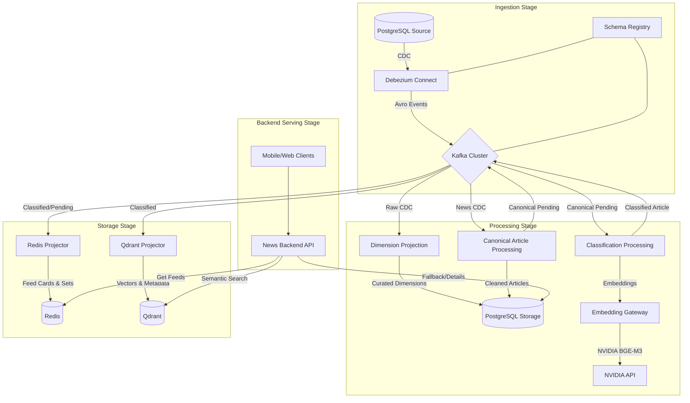

# Imperium News Streaming Platform - Architecture Documentation

Welcome to the comprehensive documentation of the Imperium Real-Time News Streaming Platform. This documentation is organized by the four main stages of our data lifecycle: Ingestion, Processing, Storage, and Serving.

## High-Level Architecture

The following diagram illustrates the end-to-end flow of data from the source PostgreSQL database to the final serving layer.

## Documentation Stages

Explore the documentation for each stage:

1.  **[Ingestion Stage](./ingestion/README.md)**: Capturing database changes using CDC, Kafka Connect, and Debezium.
2.  **[Processing Stage](./processing/README.md)**: Normalization, dimension materialization, enrichment, and AI-powered classification.
3.  **[Storage Stage](./storage/README.md)**: Projections into PostgreSQL, Redis, and Qdrant.
4.  **[Backend Serving Stage](./backend/README.md)**: Endpoints, logic, ranking, and caching strategies.

## Core Principles

- **PostgreSQL is the Source of Truth**: All data eventually reconciles back to PostgreSQL.
- **Event-Driven Architecture**: Kafka acts as the central nervous system, enabling decoupled and scalable services.
- **Stateless Processing**: Spark jobs are designed to be idempotent and replayable.
- **Optimized Serving**: Redis and Qdrant provide low-latency retrieval for different use cases (feed vs. search).

## Operational Dashboards & Tools

The platform includes several UIs for monitoring and debugging, available via the `ui` Docker profile:

| Tool | Port | Purpose |
|---|---|---|
| **Kafka UI** | `48089` | Inspect topics, consumer groups, and Avro schemas |
| **RedisInsight** | `48090` | Explore feed ZSETs, article hashes, and user prefs |
| **Adminer** | `48084` | Query PostgreSQL source and storage tables |
| **Spark History** | `48182` | Monitor Spark job performance and execution logs |

## Deployment Profiles

The system is modularized using Docker Compose profiles:
- `backbone`: Kafka, Karapace (Schema Registry), Zookeeper.
- `source`: PostgreSQL production source.
- `processing`: Debezium, Spark Master/Workers, and processing drivers.
- `serving`: Redis, Qdrant, and Spring Boot Backend.
- `ui`: Monitoring tools (Kafka UI, RedisInsight, etc.).
