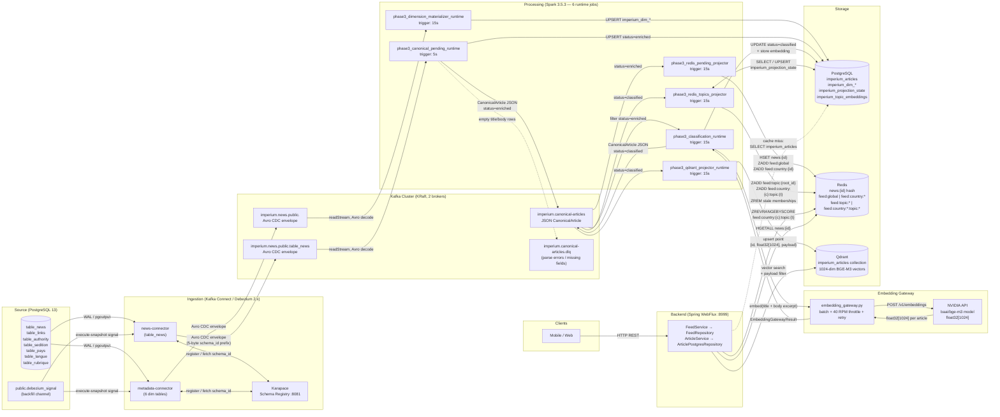

# Imperium News Streaming Platform — Architecture Documentation

> **Start here.** This folder is the authoritative documentation for the full data stack. Each sub-folder covers one stage of the pipeline end-to-end: its components, data flow, source file references, and config.

## Table of Contents

- [High-Level Architecture](#high-level-architecture)
- [Data Contract Quick Reference](#data-contract-quick-reference)
- [Deployment Profiles](#deployment-profiles)
- [Operational Dashboards](#operational-dashboards)
- [Where to Start for Common Tasks](#where-to-start-for-common-tasks)
- [Stage Documentation](#stage-documentation)

---

## High-Level Architecture

The platform ingests news articles via PostgreSQL CDC, enriches and classifies them using Spark and NVIDIA embeddings, projects the results into Redis and Qdrant, then serves a reactive Spring Boot API to mobile/web clients.

```mermaid
flowchart LR
    subgraph SRC["Source (PostgreSQL 13)"]
        PG_SRC[("table_news\ntable_links\ntable_authority\ntable_sedition\ntable_pays\ntable_langue\ntable_rubrique")]
        SIG["public.debezium_signal\n(backfill channel)"]
    end

    subgraph ING["Ingestion (Kafka Connect / Debezium 2.x)"]
        DBZ_N["news-connector\n(table_news)"]
        DBZ_M["metadata-connector\n(6 dim tables)"]
        SR["Karapace\nSchema Registry :8081"]
    end

    subgraph BUS["Kafka Cluster (KRaft, 2 brokers)"]
        T_NEWS["imperium.news.public.table_news\nAvro CDC envelope"]
        T_DIM["imperium.news.public.<dim_table>\nAvro CDC envelope"]
        T_CAN["imperium.canonical-articles\nJSON CanonicalArticle"]
        T_DLQ["imperium.canonical-articles.dlq\n(parse errors / missing fields)"]
    end

    subgraph PROC["Processing (Spark 3.5.3 — 6 runtime jobs)"]
        JOB_DIM["phase3_dimension_materializer_runtime\ntrigger: 15s"]
        JOB_CAN["phase3_canonical_pending_runtime\ntrigger: 5s"]
        JOB_CLS["phase3_classification_runtime\ntrigger: 15s"]
        JOB_RP["phase3_redis_pending_projector\ntrigger: 15s"]
        JOB_RT["phase3_redis_topics_projector\ntrigger: 15s"]
        JOB_QD["phase3_qdrant_projector_runtime\ntrigger: 15s"]
    end

    subgraph AI["Embedding Gateway"]
        GW["embedding_gateway.py\nbatch + 40 RPM throttle + retry"]
        NV["NVIDIA API\nbaai/bge-m3 model\nfloat32[1024]"]
    end

    subgraph STORE["Storage"]
        PG_ST[("PostgreSQL\nimperium_articles\nimperium_dim_*\nimperium_projection_state\nimperium_topic_embeddings")]
        REDIS[("Redis\nnews:{id} hash\nfeed:global | feed:country:*\nfeed:topic:* | feed:country:*:topic:*")]
        QDRANT[("Qdrant\nimperium_articles collection\n1024-dim BGE-M3 vectors")]
    end

    subgraph API["Backend (Spring WebFlux :8999)"]
        SPRING["FeedService → FeedRepository\nArticleService → ArticlePostgresRepository"]
    end

    subgraph CLIENT["Clients"]
        MOB["Mobile / Web"]
    end

    PG_SRC -->|"WAL / pgoutput"| DBZ_N
    PG_SRC -->|"WAL / pgoutput"| DBZ_M
    SIG -->|"execute-snapshot signal"| DBZ_N
    SIG -->|"execute-snapshot signal"| DBZ_M

    DBZ_N <-->|"register / fetch schema_id"| SR
    DBZ_M <-->|"register / fetch schema_id"| SR
    DBZ_N -->|"Avro CDC envelope\n(5-byte schema_id prefix)"| T_NEWS
    DBZ_M -->|"Avro CDC envelope"| T_DIM

    T_DIM -->|"readStream, Avro decode"| JOB_DIM
    T_NEWS -->|"readStream, Avro decode"| JOB_CAN

    JOB_DIM -->|"UPSERT imperium_dim_*"| PG_ST
    JOB_CAN -->|"UPSERT status=enriched"| PG_ST
    JOB_CAN -->|"CanonicalArticle JSON\nstatus=enriched"| T_CAN
    JOB_CAN -.->|"empty title/body rows"| T_DLQ

    T_CAN -->|"filter status=enriched"| JOB_CLS
    JOB_CLS -->|"embed(title + body excerpt)"| GW
    GW -->|"POST /v1/embeddings"| NV
    NV -->|"float32[1024] per article"| GW
    GW -->|"EmbeddingGatewayResult"| JOB_CLS
    JOB_CLS -->|"UPDATE status=classified\n+ store embedding"| PG_ST
    JOB_CLS -->|"CanonicalArticle JSON\nstatus=classified"| T_CAN

    T_CAN -->|"status=enriched"| JOB_RP
    T_CAN -->|"status=classified"| JOB_RT
    T_CAN -->|"status=classified"| JOB_QD

    JOB_RP -->|"HSET news:{id}\nZADD feed:global\nZADD feed:country:{id}"| REDIS
    JOB_RT -->|"ZADD feed:topic:{root_id}\nZADD feed:country:{c}:topic:{t}\nZREM stale memberships"| REDIS
    JOB_RT <-->|"SELECT / UPSERT\nimperium_projection_state"| PG_ST
    JOB_QD -->|"upsert point\n{id, float32[1024], payload}"| QDRANT

    SPRING -->|"ZREVRANGEBYSCORE\nfeed:country:{c}:topic:{t}"| REDIS
    SPRING -->|"HGETALL news:{id}"| REDIS
    SPRING -.->|"cache miss:\nSELECT imperium_articles"| PG_ST
    SPRING -->|"vector search\n+ payload filter"| QDRANT
    MOB -->|"HTTP REST"| SPRING
```

---

## Data Contract Quick Reference

These are the three data shapes that cross stage boundaries. All other data is internal to a stage.

| Contract | Format | Source of Truth |
|---|---|---|
| **CDC Envelope** | Avro `{before, after, op, source, ts_ms}` | Debezium + Karapace Schema Registry |
| **CanonicalArticle** | JSON (Python dataclass serialized) | [`apps/processing/news-pipeline/src/imperium_news_pipeline/phase3/canonical.py`](../../apps/processing/news-pipeline/src/imperium_news_pipeline/phase3/canonical.py) |
| **Projection State** | PostgreSQL row `(article_id, country_id, root_topic_id, published_at)` | [`apps/processing/news-pipeline/src/imperium_news_pipeline/phase3/projection_state.py`](../../apps/processing/news-pipeline/src/imperium_news_pipeline/phase3/projection_state.py) |

The `classification_status` field on `CanonicalArticle` drives all routing logic:
- `enriched` → written after Canonical Emit job; triggers Redis pending projector
- `classified` → written after Classification job; triggers Redis topics + Qdrant projectors
- `failed` → articles that could not be embedded or classified

---

## Deployment Profiles

The full stack is defined in [`docker-compose.yml`](../../docker-compose.yml) and split into profiles:

| Profile | Services | Start command |
|---|---|---|
| `backbone` | `kafka` (broker 1), `kafka-broker-2`, `schema-registry` (Karapace) | `docker compose --profile backbone up` |
| `source` | `postgres-source` (PostgreSQL 13, WAL logical replication enabled) | `docker compose --profile source up` |
| `processing` | `kafka-connect` (Debezium), `spark-master`, `spark-worker` ×3, `spark-history-server`, 6 Spark driver containers, `imperium-redis-projector`, `imperium-postgres-projector`, `imperium-qdrant-projector` | `docker compose --profile processing up` |
| `serving` | `redis`, `qdrant`, `llama-cpp` (local embedding fallback), Spring Boot API | `docker compose --profile serving up` |
| `ui` | `kafka-ui`, `redis-ui` (RedisInsight), `pg-ui` (Adminer) | `docker compose --profile ui up` |

**Typical local startup order:** `backbone` → `source` → `processing` → `serving` → `ui`

---

## Operational Dashboards

All available via the `ui` profile:

| Tool | URL | Purpose |
|---|---|---|
| **Kafka UI** | `http://localhost:48089` | Inspect topics, consumer groups, Avro schemas, offset lag |
| **RedisInsight** | `http://localhost:48090` | Explore feed ZSETs, article hashes, user preference keys |
| **Adminer** | `http://localhost:48084` | Query PostgreSQL source and `imperium_*` storage tables |
| **Spark History Server** | `http://localhost:48182` | Monitor Spark streaming job performance and execution DAGs |

---

## Where to Start for Common Tasks

| Task | Start here |
|---|---|
| Add or modify a Kafka topic | [`apps/ingestion/topic-bootstrap/`](../../apps/ingestion/topic-bootstrap/) |
| Register or update a Debezium connector | [`apps/ingestion/connector-bootstrap/`](../../apps/ingestion/connector-bootstrap/) |
| Trigger a full or incremental data backfill | [`apps/ingestion/connector-bootstrap/news/emit-full-backfill-signal.sh`](../../apps/ingestion/connector-bootstrap/news/emit-full-backfill-signal.sh) |
| Change enrichment or canonical article logic | [`phase3/canonical.py`](../../apps/processing/news-pipeline/src/imperium_news_pipeline/phase3/canonical.py), [`phase3/pending_feed_runtime.py`](../../apps/processing/news-pipeline/src/imperium_news_pipeline/phase3/pending_feed_runtime.py) |
| Change classification or topic taxonomy | [`phase3/classification.py`](../../apps/processing/news-pipeline/src/imperium_news_pipeline/phase3/classification.py), [`resources/news_topic_taxonomy_medtop_en_us.json`](../../apps/processing/news-pipeline/resources/news_topic_taxonomy_medtop_en_us.json) |
| Change Redis feed key structure | [`phase3/redis_projection.py`](../../apps/processing/news-pipeline/src/imperium_news_pipeline/phase3/redis_projection.py) **and** [`Constants.java`](../../backend/news-app/src/main/java/solutions/imperium/news_api/core/Constants.java) — must stay in sync |
| Add a new API endpoint | [`backend/news-app/src/main/java/solutions/imperium/news_api/domain/`](../../backend/news-app/src/main/java/solutions/imperium/news_api/domain/) |
| Inspect the PostgreSQL schema | [`apps/processing/news-pipeline/resources/schema/imperium_news_articles.sql`](../../apps/processing/news-pipeline/resources/schema/imperium_news_articles.sql) |

---

## Stage Documentation

| Stage | What it does | Doc |
|---|---|---|
| **Ingestion** | Captures PostgreSQL WAL changes via Debezium and publishes Avro CDC events to Kafka | [ingestion/README.md](./ingestion/README.md) |
| **Processing** | Decodes CDC events, builds canonical articles, classifies by topic using NVIDIA embeddings | [processing/README.md](./processing/README.md) |
| **Storage** | Projects canonical articles into Redis (feeds), Qdrant (vectors), and PostgreSQL (state) | [storage/README.md](./storage/README.md) |
| **Backend Serving** | Serves personalized feeds, article details, and semantic search via reactive Spring Boot API | [backend/README.md](./backend/README.md) |

See also: [Product Requirements Document](./PRD.md) for objectives, success metrics, and non-goals.

---

## Core Principles

- **PostgreSQL is the source of truth**: All canonical article state lives in `imperium_articles`. Redis and Qdrant are projections, not primaries.
- **Event-driven, decoupled stages**: Kafka is the integration bus. Stages communicate via topics, not direct calls.
- **Stateless, replayable processing**: Spark jobs are idempotent. Projection state in PostgreSQL enables safe replay without duplication.
- **Optimized serving layer**: Redis ZSETs serve O(log N) feed queries; Qdrant serves approximate nearest-neighbor semantic search. The Spring API never does expensive reads from PostgreSQL on the hot path.
