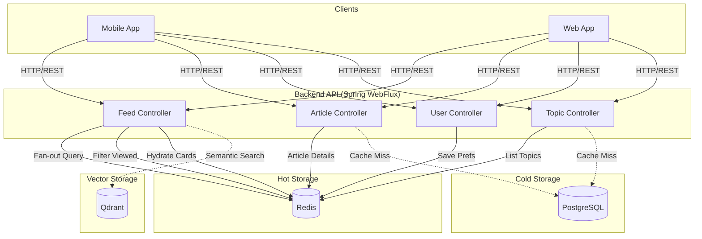
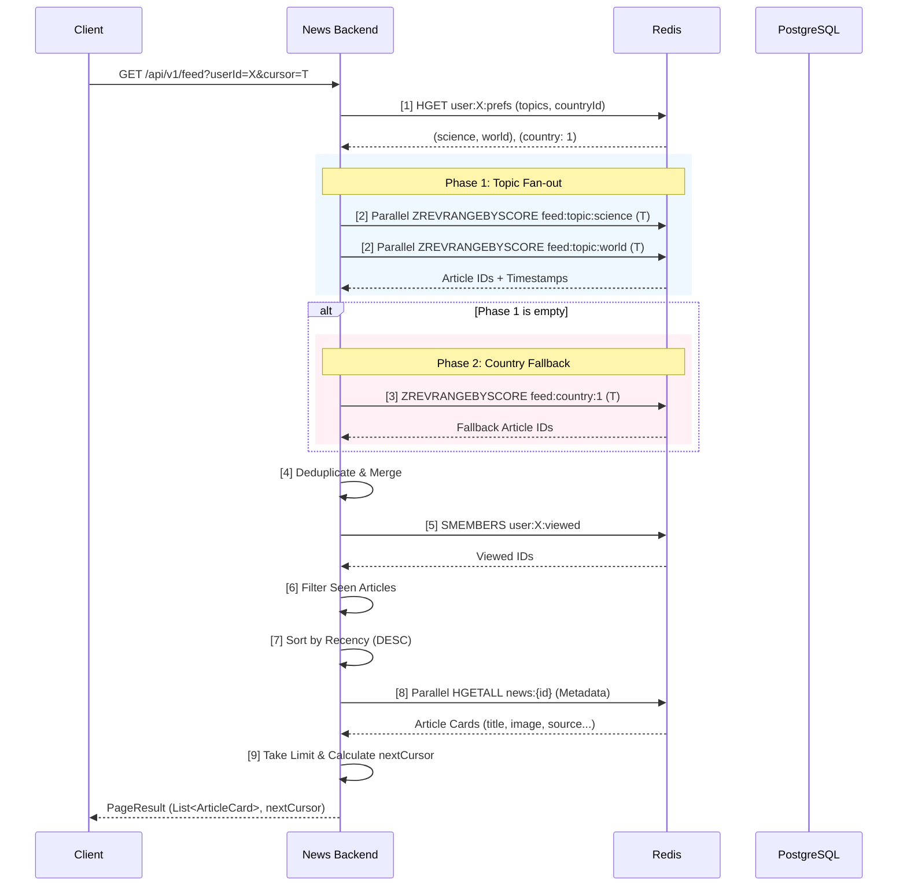

# Backend Serving Stage: API & Personalization

The Backend Serving Stage provides a high-performance, reactive API for mobile and web clients. It leverages the pre-computed projections in Redis and Qdrant to deliver personalized content with minimal latency.

## Architecture Diagram


## Architecture & Flow



## Core Functional Domains

### 1. User & Onboarding
- **Anonymous Identity**: Users are assigned a UUID upon onboarding.
- **Preferences**: Country and topic preferences are stored in Redis (`user:{userId}:prefs`).
- **View Tracking**: Articles seen by the user are tracked in a Redis Set (`user:{userId}:viewed`) with a 12-day expiration to ensure feed freshness.

### 2. Personalized Feed Generation
The feed engine uses a two-phase fan-out strategy to prioritize user interests:
- **Phase 1: Topic Fan-out**: Simultaneously queries Redis Sorted Sets for all topics the user follows.
- **Phase 2: Country Fallback**: If topic-specific content is exhausted, the engine falls back to the broader country feed (`feed:country:{id}`).
- **Ranking**: Articles are interleaved and sorted by recency (`published_at`).
- **Pagination**: Uses **Cursor-based pagination** (exclusive timestamp scores) to ensure stability even as new articles are ingested.

### 3. Article Retrieval & Bookmarks
- **Article Cards**: Fetched directly from Redis hashes for lightning-fast feed rendering.
- **Full Details**: The full article body is fetched via a cache-aside pattern (Redis JSON cache -> PostgreSQL).
- **Bookmarks**: Users can save articles to a persistent Redis Set (`user:{userId}:saved`).

### 4. Semantic Search (Integration)
- **Vector Search**: Backend is wired to Qdrant to support "Similar Articles" and semantic queries.
- **Hybrid Filtering**: Combines vector similarity with metadata filters (e.g., "Show similar technology news from France").

## Performance Principles
- **Non-Blocking I/O**: The entire stack is built on Spring WebFlux and Project Reactor, ensuring high concurrency with minimal resource overhead.
- **Parallel Execution**: Prefs loading, topic fan-out, and card hydration all happen in parallel using reactive operators.
- **Social-Media Style Interleaving**: Ensures a diverse feed by round-robin sampling from multiple topic sets.

## Ranking & Feed Generation Logic

The Imperium ranking system is designed for high-performance, personalized news delivery using a two-phase fan-out approach. It prioritizes the user's explicit topic subscriptions before falling back to general country-wide feeds.

### The Ranking Flow



### Key Ranking Principles

1.  **Recency is King**: The primary sort key is the `published_at` timestamp (mapped to Redis ZSET scores). This ensures users always see the freshest news first.
2.  **Topic Parity**: When fetching from multiple topics, the system sampling ensures that every topic has a chance to contribute to the top of the feed before sorting (Round-robin sampling from Redis ZSETs).
3.  **Stability via Cursors**: Instead of `offset/limit`, we use **Time-based Cursors**. The `nextCursor` is the timestamp of the last article in the current page. The next request asks for articles older than this timestamp, preventing duplicates if new articles are ingested while the user is scrolling.
- **Social-Media Style Interleaving**: Ensures a diverse feed by round-robin sampling from multiple topic sets.

## Observability & Monitoring

The backend exposes several operational endpoints via **Spring Boot Actuator**:
- **Health Probes**: `GET /actuator/health` provides real-time status of Redis, PostgreSQL, and Qdrant connectivity.
- **Prometheus Metrics**: `GET /actuator/prometheus` exposes JVM performance, throughput, and latency metrics for scraping.
- **API Documentation**: A collection of sample requests and expected responses is available in `api.http` for rapid developer onboarding.

## Timestamp Normalization

The backend implements a `FlexibleEpochDeserializer` to handle data heterogeneity from the upstream pipeline. It transparently converts:
- Microseconds (μs) $\to$ Seconds
- Milliseconds (ms) $\to$ Seconds
- ISO-8601 Strings $\to$ Seconds
This ensures that the **Time-based Cursors** used for pagination remain consistent across all devices and article sources.

## Static Architecture Diagram (Python)

The following Python code uses the `diagrams` library to generate a high-resolution architecture diagram for this stage.

```python
from diagrams import Diagram, Cluster, Edge
from diagrams.onprem.database import PostgreSQL
from diagrams.onprem.inmemory import Redis
from diagrams.onprem.network import Internet
from diagrams.onprem.client import Client
from diagrams.programming.framework import Spring
from diagrams.onprem.search import Solr 

with Diagram("Backend Serving Stage Architecture", show=False, filename="backend_arch", direction="TB"):
    user = Client("Mobile / Web App")
    
    with Cluster("API Layer"):
        api = Spring("Spring Boot\n(Reactive WebFlux)")
        
    with Cluster("Data Sources"):
        redis = Redis("Redis\n(Feeds, Cards, Prefs)")
        qdrant = Solr("Qdrant\n(Semantic Search)")
        pg = PostgreSQL("PostgreSQL\n(Article Details)")

    user >> Edge(label="REST API") >> api
    api >> Edge(label="Fan-out / Interleave") >> redis
    api >> Edge(label="Vector Search") >> qdrant
    api >> Edge(label="Cache-aside") >> pg
```

> [!NOTE]
> To run this script, you need to install the `diagrams` library (`pip install diagrams`) and have **Graphviz** installed on your system.
