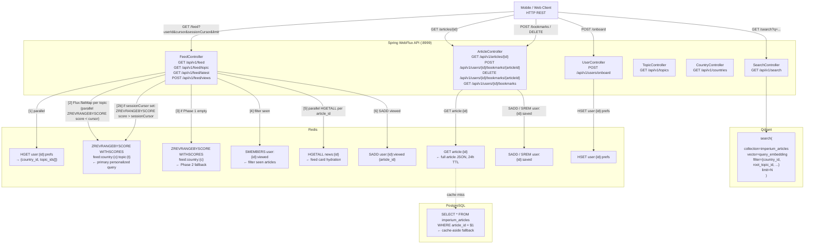
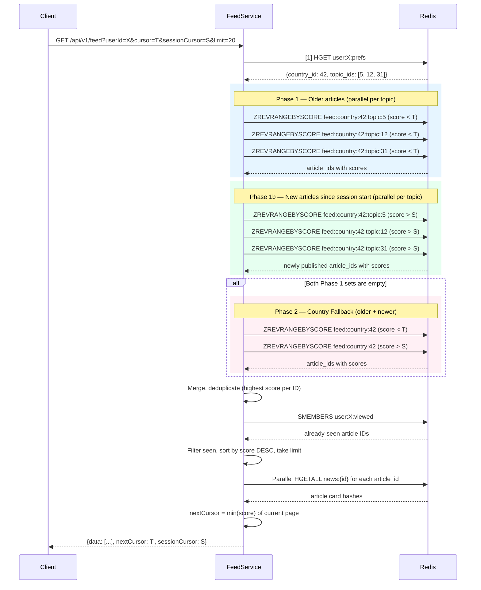

# Backend Serving Stage: API & Personalization

The Backend Serving Stage exposes a fully reactive Spring WebFlux API (port `8999`) that reads pre-computed projections from Redis and Qdrant to serve personalized feeds, article details, and semantic search to mobile/web clients.

**Data enters** via HTTP requests from clients. No Kafka consumption in this stage.  
**Data leaves** as JSON HTTP responses. The only writes are to Redis (user prefs, viewed set, saved set).

← Previous stage: [Storage](../storage/README.md) — writes the Redis ZSETs and Qdrant points consumed here.

---

## Architecture & Request Flow

```mermaid
flowchart TD
    CLIENT["Mobile / Web Client\nHTTP REST"]

    subgraph API["Spring WebFlux API (:8999)"]
        FC["FeedController\nGET /api/v1/feed\nGET /api/v1/feed/topic\nGET /api/v1/feed/latest\nPOST /api/v1/feed/views"]
        AC["ArticleController\nGET /api/v1/articles/{id}\nPOST /api/v1/users/{id}/bookmarks/{articleId}\nDELETE /api/v1/users/{id}/bookmarks/{articleId}\nGET /api/v1/users/{id}/bookmarks"]
        UC["UserController\nPOST /api/v1/users/onboard"]
        TC["TopicController\nGET /api/v1/topics"]
        CC["CountryController\nGET /api/v1/countries"]
        SC["SearchController\nGET /api/v1/search"]
    end

    subgraph REDIS["Redis"]
        PREFS["HGET user:{id}:prefs\n→ {country_id, topic_ids[]}"]
        FEED_CT["ZREVRANGEBYSCORE WITHSCORES\nfeed:country:{c}:topic:{t}\n← primary personalized query"]
        FEED_C["ZREVRANGEBYSCORE WITHSCORES\nfeed:country:{c}\n← Phase 2 fallback"]
        VIEWED["SMEMBERS user:{id}:viewed\n← filter seen articles"]
        CARD["HGETALL news:{id}\n← feed card hydration"]
        ART_CACHE["GET article:{id}\n← full article JSON, 24h TTL"]
        SADD_VIEWED["SADD user:{id}:viewed {article_id}"]
        SADD_SAVED["SADD / SREM user:{id}:saved"]
        PREFS_W["HSET user:{id}:prefs"]
    end

    subgraph PG["PostgreSQL"]
        ART_DETAIL["SELECT * FROM imperium_articles\nWHERE article_id = $1\n← cache-aside fallback"]
    end

    subgraph QDRANT["Qdrant"]
        VEC_SEARCH["search(\n  collection=imperium_articles\n  vector=query_embedding\n  filter={country_id, root_topic_id, ...}\n  limit=N\n)"]
    end

    CLIENT -->|"GET /feed?userId&cursor&sessionCursor&limit"| FC
    FC -->|"[1] parallel"| PREFS
    FC -->|"[2] Flux.flatMap per topic\n(parallel ZREVRANGEBYSCORE score < cursor)"| FEED_CT
    FC -->|"[2b] if sessionCursor set:\nZREVRANGEBYSCORE score > sessionCursor"| FEED_CT
    FC -->|"[3] if Phase 1 empty"| FEED_C
    FC -->|"[4] filter seen"| VIEWED
    FC -->|"[5] parallel HGETALL per article_id"| CARD
    FC -->|"[6] SADD viewed"| SADD_VIEWED

    CLIENT -->|"GET /articles/{id}"| AC
    AC -->|"GET article:{id}"| ART_CACHE
    ART_CACHE -.->|"cache miss"| ART_DETAIL

    CLIENT -->|"POST /bookmarks / DELETE"| AC
    AC -->|"SADD / SREM user:{id}:saved"| SADD_SAVED

    CLIENT -->|"POST /onboard"| UC
    UC -->|"HSET user:{id}:prefs"| PREFS_W

    CLIENT -->|"GET /search?q=..."| SC
    SC --> VEC_SEARCH
```

---

## Feed Generation: Two-Phase Fan-out with Session Cursor

The feed engine runs in two phases per request. All Redis calls within a phase are parallelized using Project Reactor's `Flux.flatMap`.

### Session Cursor — Real-time "Load More"

Without a session cursor, new articles published after the first page load are invisible when scrolling down (they have scores above the original cursor window) and only appear on a full page refresh.

The fix introduces a `sessionCursor` — fixed at the time of the first page load and passed back on every subsequent "load more" call. On each page request after the first, the feed engine fetches **two score windows in parallel**:

| Window | Redis range | Purpose |
|---|---|---|
| Older articles | `score < pageCursor` | Continue scrolling through historical feed |
| New articles | `score > sessionCursor` | Articles published since session started |

Both sets are merged, deduplicated (highest score wins per ID), filtered for viewed articles, and sorted by score DESC — so the newest articles naturally float to the top of each page.

**Client contract:**
- First call: `GET /api/v1/feed?userId=X&limit=20` → response includes both `nextCursor` and `sessionCursor`
- Subsequent calls: `GET /api/v1/feed?userId=X&cursor={nextCursor}&sessionCursor={sessionCursor}&limit=20`
- `sessionCursor` stays fixed for the entire scroll session; only `cursor` advances.

```mermaid
sequenceDiagram
    participant C as Client
    participant API as FeedService
    participant R as Redis

    C->>API: GET /api/v1/feed?userId=X&cursor=T&sessionCursor=S&limit=20

    API->>R: [1] HGET user:X:prefs
    R-->>API: {country_id: 42, topic_ids: [5, 12, 31]}

    rect rgb(230, 245, 255)
        Note over API,R: Phase 1 — Older articles (parallel per topic)
        API->>R: ZREVRANGEBYSCORE feed:country:42:topic:5 (score < T)
        API->>R: ZREVRANGEBYSCORE feed:country:42:topic:12 (score < T)
        API->>R: ZREVRANGEBYSCORE feed:country:42:topic:31 (score < T)
        R-->>API: article_ids with scores
    end

    rect rgb(230, 255, 240)
        Note over API,R: Phase 1b — New articles since session start (parallel per topic)
        API->>R: ZREVRANGEBYSCORE feed:country:42:topic:5 (score > S)
        API->>R: ZREVRANGEBYSCORE feed:country:42:topic:12 (score > S)
        API->>R: ZREVRANGEBYSCORE feed:country:42:topic:31 (score > S)
        R-->>API: newly published article_ids with scores
    end

    alt Both Phase 1 sets are empty
        rect rgb(255, 240, 245)
            Note over API,R: Phase 2 — Country Fallback (older + newer)
            API->>R: ZREVRANGEBYSCORE feed:country:42 (score < T)
            API->>R: ZREVRANGEBYSCORE feed:country:42 (score > S)
            R-->>API: article_ids with scores
        end
    end

    API->>API: Merge, deduplicate (highest score per ID)
    API->>R: SMEMBERS user:X:viewed
    R-->>API: already-seen article IDs
    API->>API: Filter seen, sort by score DESC, take limit

    API->>R: Parallel HGETALL news:{id} for each article_id
    R-->>API: article card hashes

    API->>API: nextCursor = min(score) of current page
    API-->>C: {data: [...], nextCursor: T', sessionCursor: S}
```

**Cursor:** a Unix epoch in seconds. Millisecond cursors from older clients are normalized by the `rawCursor > 20_000_000_000L` check in [`FeedService.java`](../../../backend/news-app/src/main/java/solutions/imperium/news_api/domain/feed/FeedService.java).

---

## API Endpoints

| Method | Path | Description |
|---|---|---|
| `GET` | `/api/v1/feed?userId&cursor&sessionCursor&limit` | Personalized feed (two-phase fan-out + real-time new articles) |
| `GET` | `/api/v1/feed/topic?userId&topicId&cursor&sessionCursor&limit` | Topic-filtered feed |
| `GET` | `/api/v1/feed/latest?userId&cursor&sessionCursor&limit` | Country-latest feed |
| `POST` | `/api/v1/feed/views` | Track viewed article IDs |
| `GET` | `/api/v1/articles/{articleId}` | Full article detail (Redis cache-aside → PG) |
| `POST` | `/api/v1/users/onboard` | Onboard new user, generate UUID, store prefs |
| `POST` | `/api/v1/users/{userId}/bookmarks/{articleId}` | Add bookmark |
| `DELETE` | `/api/v1/users/{userId}/bookmarks/{articleId}` | Remove bookmark |
| `GET` | `/api/v1/users/{userId}/bookmarks` | List bookmarks |
| `GET` | `/api/v1/topics` | List available topics |
| `GET` | `/api/v1/countries` | List available countries |
| `GET` | `/api/v1/search` | Semantic search via Qdrant |

---

## Key Source Files

| File | Description |
|---|---|
| [`core/Constants.java`](../../../backend/news-app/src/main/java/solutions/imperium/news_api/core/Constants.java) | All Redis key pattern constants — single source of truth for the backend; must stay in sync with `redis_projection.py` |
| [`domain/feed/FeedService.java`](../../../backend/news-app/src/main/java/solutions/imperium/news_api/domain/feed/FeedService.java) | Two-phase fan-out orchestration; cursor normalization; topic parity round-robin |
| [`domain/feed/FeedRepository.java`](../../../backend/news-app/src/main/java/solutions/imperium/news_api/domain/feed/FeedRepository.java) | Reactive Redis queries: `ZREVRANGEBYSCORE`, `HGETALL`, `SMEMBERS` |
| [`domain/article/ArticleService.java`](../../../backend/news-app/src/main/java/solutions/imperium/news_api/domain/article/ArticleService.java) | Cache-aside pattern: Redis `GET article:{id}` → on miss, query PostgreSQL → cache result |
| [`domain/article/ArticlePostgresRepository.java`](../../../backend/news-app/src/main/java/solutions/imperium/news_api/domain/article/ArticlePostgresRepository.java) | Reactive R2DBC query on `imperium_articles` |
| [`domain/user/UserService.java`](../../../backend/news-app/src/main/java/solutions/imperium/news_api/domain/user/UserService.java) | UUID generation; `HSET user:{id}:prefs` with `country_id` and `topic_ids[]` |
| [`src/main/resources/application.yml`](../../../backend/news-app/src/main/resources/application.yml) | R2DBC, Redis, Qdrant connection config |
| [`pom.xml`](../../../backend/news-app/pom.xml) | Dependencies: Spring Boot 4, Spring WebFlux, Spring AI 2.0, reactive Redis, R2DBC |

---

## Key Environment Variables

| Variable | Purpose |
|---|---|
| `SERVER_PORT` | API listen port (default `8999`) |
| `SPRING_REDIS_HOST` | Redis hostname |
| `SPRING_REDIS_PORT` | Redis port (default `6379`) |
| `SPRING_R2DBC_URL` | PostgreSQL R2DBC connection URL |
| `SPRING_R2DBC_USERNAME` / `PASSWORD` | PostgreSQL credentials |
| `QDRANT_HOST` | Qdrant hostname |
| `QDRANT_PORT` | Qdrant HTTP port (default `6333`) |

---

## Observability

Spring Boot Actuator endpoints available at `/actuator`:

| Endpoint | Purpose |
|---|---|
| `GET /actuator/health` | Liveness/readiness + connectivity status for Redis, PostgreSQL, Qdrant |
| `GET /actuator/prometheus` | JVM metrics, throughput, p99 latency — scraped by Prometheus |

---

## Timestamp Normalization

The backend handles heterogeneous timestamp formats from upstream via `FlexibleEpochDeserializer`:
- Microseconds → seconds
- Milliseconds → seconds
- ISO-8601 string → seconds

This keeps cursor-based pagination stable across all clients and article sources.
