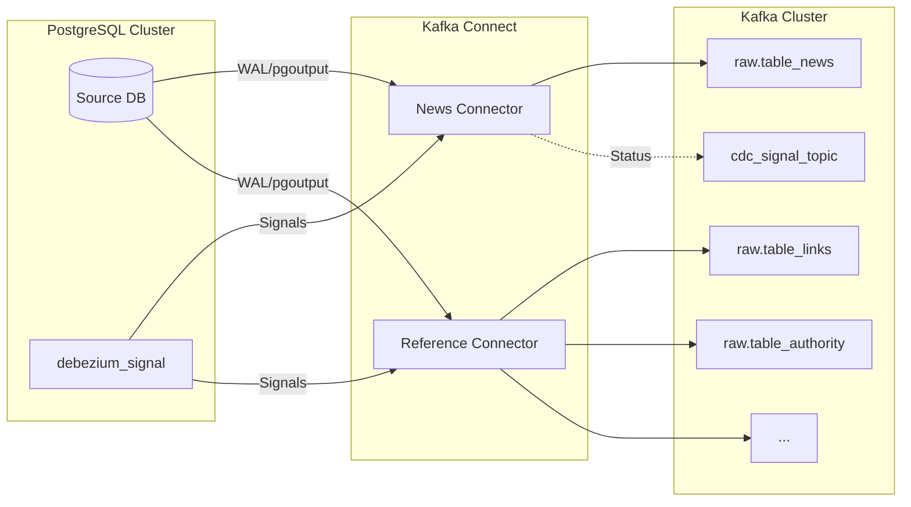

# Ingestion Stage: Data Capture & Streaming

The Ingestion Stage is responsible for capturing changes from the production PostgreSQL database and publishing them as structured events into the Kafka cluster.

## Architecture Diagram


## Architecture & Flow



## Components

### 1. PostgreSQL Source
The source of truth is a PostgreSQL database. We use the `pgoutput` logical decoding plugin to stream changes from the Write-Ahead Log (WAL).
- **Publication**: Specific publications are created for news and reference tables.
- **Replication Slot**: Debezium maintains replication slots to ensure no data loss during connector downtime.

### 2. Debezium (Kafka Connect)
We deploy Debezium connectors on a Kafka Connect cluster.
- **News Connector**: Dedicated to high-volume news ingestion from `table_news`.
- **Reference Connector**: Captures changes from metadata tables like `table_links`, `table_authority`, `table_pays`, etc.
- **CDC Envelopes**: Events include `before` and `after` states, operation type (`c`, `u`, `d`), and source metadata.

### 3. Kafka Cluster & Topics
Kafka serves as the event backbone.
- **Raw Topics**: Each PostgreSQL table maps to a specific Kafka topic (e.g., `imperium.raw.public.table_news`).
- **Avro Serialization**: All messages are serialized using Avro, with schemas managed in the **Schema Registry**.
- **Retention**: Topics are configured with appropriate retention and compaction policies based on the data type (e.g., compaction for reference tables).

### 4. Schema Registry
Ensures data consistency and schema evolution safety. Producers (Debezium) and consumers (Spark) both interact with the Schema Registry to validate event structures.

## Signals and Backfills
Debezium's signaling mechanism is used to trigger ad-hoc snapshots or backfills without restarting the connectors.
- **Full Backfill**: Triggers a complete snapshot of the source tables.
## Static Architecture Diagram (Python)

The following Python code uses the `diagrams` library to generate a high-resolution architecture diagram for this stage.

```python
from diagrams import Diagram, Cluster, Edge
from diagrams.onprem.database import PostgreSQL
from diagrams.onprem.queue import Kafka
from diagrams.onprem.network import Kong
from diagrams.onprem.compute import Server

with Diagram("Ingestion Stage Architecture", show=False, filename="ingestion_arch", direction="LR"):
    with Cluster("Source Infrastructure"):
        db_source = PostgreSQL("PostgreSQL\nProduction")
        signal_table = PostgreSQL("Debezium\nSignals")

    with Cluster("Kafka Connect"):
        news_connector = Kong("Debezium\nNews Connector")
        ref_connector = Kong("Debezium\nRef Connector")

    with Cluster("Streaming Backbone"):
        kafka = Kafka("Kafka Cluster")
        schema_registry = Server("Schema Registry")
        
    db_source >> Edge(label="WAL/pgoutput") >> news_connector
    db_source >> Edge(label="WAL/pgoutput") >> ref_connector
    signal_table >> Edge(label="Signals") >> news_connector
    
    news_connector >> kafka
    ref_connector >> kafka
    kafka - schema_registry
```

> [!NOTE]
> To run this script, you need to install the `diagrams` library (`pip install diagrams`) and have **Graphviz** installed on your system.
