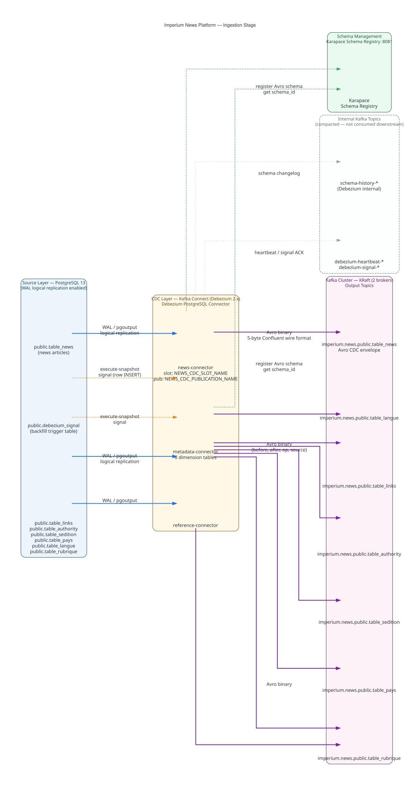
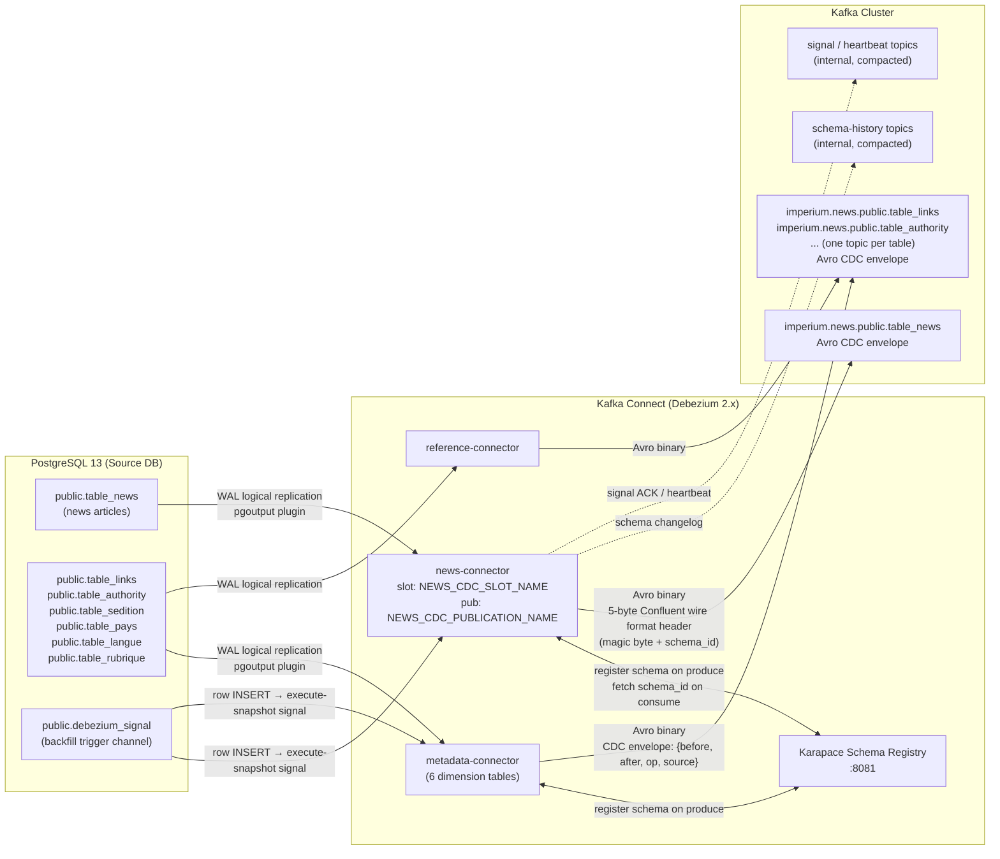

# Ingestion Stage: Data Capture & Streaming

The Ingestion Stage captures every insert, update, and delete on the source PostgreSQL database and publishes them as Avro-encoded CDC events into Kafka. It is **configuration-only** — no application code runs here, only shell scripts and Debezium connector JSON files.



**Data enters** from PostgreSQL WAL.  
**Data leaves** as Avro CDC envelopes on `imperium.news.public.*` Kafka topics.

→ Next stage: [Processing](../processing/README.md) — Spark reads these topics to build canonical articles.

---

## Architecture & Flow


```mermaid
flowchart LR
    subgraph SRC["PostgreSQL 13 (Source DB)"]
        TBL_NEWS["public.table_news\n(news articles)"]
        TBL_DIM["public.table_links\npublic.table_authority\npublic.table_sedition\npublic.table_pays\npublic.table_langue\npublic.table_rubrique"]
        SIG_TBL["public.debezium_signal\n(backfill trigger channel)"]
    end

    subgraph KCN["Kafka Connect (Debezium 2.x)"]
        DBZ_N["news-connector\nslot: NEWS_CDC_SLOT_NAME\npub: NEWS_CDC_PUBLICATION_NAME"]
        DBZ_M["metadata-connector\n(6 dimension tables)"]
        DBZ_R["reference-connector"]
        SR["Karapace Schema Registry\n:8081"]
    end

    subgraph KAFKA["Kafka Cluster"]
        T_NEWS["imperium.news.public.table_news\nAvro CDC envelope"]
        T_DIM["imperium.news.public.table_links\nimperium.news.public.table_authority\n... (one topic per table)\nAvro CDC envelope"]
        T_HIST["schema-history topics\n(internal, compacted)"]
        T_SIG["signal / heartbeat topics\n(internal, compacted)"]
    end

    TBL_NEWS -->|"WAL logical replication\npgoutput plugin"| DBZ_N
    TBL_DIM -->|"WAL logical replication\npgoutput plugin"| DBZ_M
    TBL_DIM -->|"WAL logical replication"| DBZ_R

    SIG_TBL -->|"row INSERT → execute-snapshot signal"| DBZ_N
    SIG_TBL -->|"row INSERT → execute-snapshot signal"| DBZ_M

    DBZ_N <-->|"register schema on produce\nfetch schema_id on consume"| SR
    DBZ_M <-->|"register schema on produce"| SR

    DBZ_N -->|"Avro binary\n5-byte Confluent wire format header\n(magic byte + schema_id)"| T_NEWS
    DBZ_M -->|"Avro binary\nCDC envelope: {before, after, op, source}"| T_DIM
    DBZ_R -->|"Avro binary"| T_DIM

    DBZ_N -.->|"schema changelog"| T_HIST
    DBZ_N -.->|"signal ACK / heartbeat"| T_SIG
```

---

## Component Breakdown

| Component | Docker Service | Endpoint | Config Location |
|---|---|---|---|
| Debezium Kafka Connect | `debezium` (profile: `processing`) | `:8083` REST API | — |
| News Connector | registered via script | POST to `:8083/connectors` | [`connector-bootstrap/news/news-connector.json`](../../../apps/ingestion/connector-bootstrap/news/news-connector.json) |
| Metadata Connector | registered via script | POST to `:8083/connectors` | [`connector-bootstrap/metadata/metadata-connector.json`](../../../apps/ingestion/connector-bootstrap/metadata/metadata-connector.json) |
| Reference Connector | registered via script | POST to `:8083/connectors` | [`connector-bootstrap/reference/reference-connector.json`](../../../apps/ingestion/connector-bootstrap/reference/reference-connector.json) |
| Karapace Schema Registry | `karapace-registry` (profile: `backbone`) | `:8081` | `docker-compose.yml` |
| Kafka | `kafka` + `kafka-broker-2` (profile: `backbone`) | `:9092` / `:9093` | `docker-compose.yml` |

---

## How Data Enters and Leaves

**Enters:**
PostgreSQL streams WAL changes via the `pgoutput` logical replication plugin. Debezium reads these through a replication slot (no polling; zero-latency change capture). Snapshot mode is `never` by default — initial loads are triggered on-demand via signals.

**Leaves:**
Avro-serialized CDC envelopes written to Kafka topics prefixed `imperium.news.public.`. Every message uses the Confluent wire format: a 5-byte header (1 magic byte + 4-byte schema_id) followed by the Avro binary payload. Downstream Spark consumers strip this header and fetch the schema from Karapace at the embedded `schema_id`.

**CDC Envelope structure:**
```json
{
  "before": { ... },
  "after":  { ... },
  "op":     "c | u | d | r",
  "source": { "table": "table_news", "ts_ms": 1234567890 }
}
```
- `op=r` → snapshot read (backfill)
- `op=c` → insert, `op=u` → update, `op=d` → delete

---

## Key Source Files

| File | Description |
|---|---|
| [`connector-bootstrap/news/news-connector.json`](../../../apps/ingestion/connector-bootstrap/news/news-connector.json) | Debezium connector config for `table_news`; all values env-parameterized |
| [`connector-bootstrap/metadata/metadata-connector.json`](../../../apps/ingestion/connector-bootstrap/metadata/metadata-connector.json) | Connector config for all 6 dimension tables |
| [`connector-bootstrap/news/register-news-connector.sh`](../../../apps/ingestion/connector-bootstrap/news/register-news-connector.sh) | POSTs `news-connector.json` to the Kafka Connect REST API |
| [`connector-bootstrap/metadata/register-metadata-connector.sh`](../../../apps/ingestion/connector-bootstrap/metadata/register-metadata-connector.sh) | Registers the metadata connector |
| [`connector-bootstrap/news/emit-full-backfill-signal.sh`](../../../apps/ingestion/connector-bootstrap/news/emit-full-backfill-signal.sh) | Inserts an `execute-snapshot` row into `public.debezium_signal` |
| [`connector-bootstrap/news/full-backfill-signal.json`](../../../apps/ingestion/connector-bootstrap/news/full-backfill-signal.json) | Signal payload for a full `table_news` snapshot |
| [`connector-bootstrap/news/recent-backfill-signal.json`](../../../apps/ingestion/connector-bootstrap/news/recent-backfill-signal.json) | Signal payload for an incremental/recent snapshot |
| [`topic-bootstrap/news/bootstrap-news-topics.sh`](../../../apps/ingestion/topic-bootstrap/news/bootstrap-news-topics.sh) | Creates Kafka topics with correct partition count and retention settings |
| [`topic-bootstrap/metadata/bootstrap-metadata-topics.sh`](../../../apps/ingestion/topic-bootstrap/metadata/bootstrap-metadata-topics.sh) | Creates Kafka topics for dimension tables (compacted) |

---

## Key Environment Variables

These are injected into connector JSON files at registration time:

| Variable | Used In | Purpose |
|---|---|---|
| `NEWS_CDC_CONNECTOR_NAME` | `news-connector.json` | Connector name in Kafka Connect |
| `NEWS_CDC_TOPIC_PREFIX` | `news-connector.json` | Topic prefix (e.g. `imperium.news`) |
| `NEWS_CDC_SLOT_NAME` | `news-connector.json` | PostgreSQL replication slot name |
| `NEWS_CDC_PUBLICATION_NAME` | `news-connector.json` | PostgreSQL publication name |
| `SOURCE_PG_HOST` | All connector JSONs | Source PostgreSQL hostname |
| `SOURCE_PG_PORT` | All connector JSONs | Source PostgreSQL port (default `5432`) |
| `SOURCE_PG_USER` | All connector JSONs | Replication user |
| `SOURCE_PG_PASSWORD` | All connector JSONs | Replication user password |
| `SOURCE_PG_DATABASE` | All connector JSONs | Source database name |
| `KAFKA_BOOTSTRAP_SERVERS` | All connector JSONs | Kafka bootstrap address |
| `SCHEMA_REGISTRY_URL` | All connector JSONs | Karapace URL (e.g. `http://karapace-registry:8081`) |

---

## Backfill Operations

Debezium's signal channel allows on-demand snapshots without restarting connectors:

```bash
# Full snapshot of table_news (all rows, any time)
./apps/ingestion/connector-bootstrap/news/emit-full-backfill-signal.sh

# Incremental snapshot (recent rows only, based on a WHERE filter in the signal JSON)
./apps/ingestion/connector-bootstrap/news/emit-recent-backfill-signal.sh
```

The signal inserts a row into `public.debezium_signal`. Debezium detects it via its signal channel, executes the snapshot, and emits `op=r` events to the Kafka topic. These are indistinguishable from live CDC events to downstream consumers.

---

## Sink Templates (Optional)

`apps/ingestion/sink-templates/` contains Kafka Connect JDBC sink connector configs that can mirror raw CDC topics back into a secondary PostgreSQL for debugging. These are not part of the normal production flow.

| Template | Description |
|---|---|
| [`sink-templates/temp-postgres/news-table-news-sink.json`](../../../apps/ingestion/sink-templates/temp-postgres/news-table-news-sink.json) | Reads from `table_news` topic, upserts into `sink_news` in a target PG (uses `ExtractNewRecordState` SMT to unwrap envelope) |
| [`sink-templates/metadata/`](../../../apps/ingestion/sink-templates/metadata/) | JDBC sink configs for curated dimension table targets |
