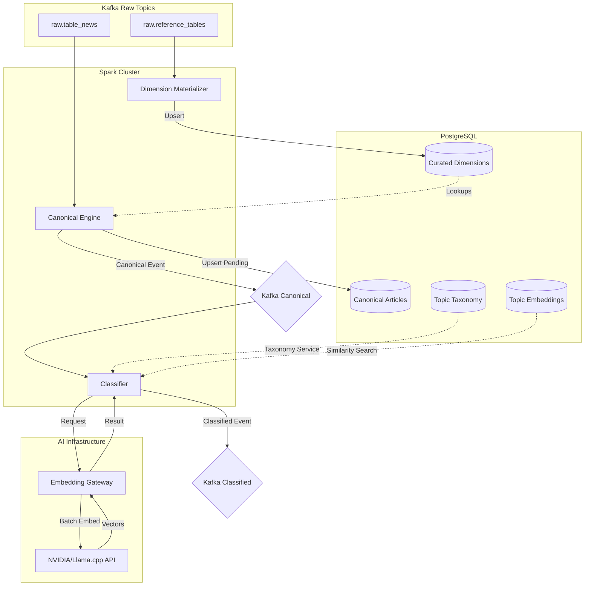

# Processing Stage: Enrichment & AI Classification

The Processing Stage transforms raw database events into enriched, classified, and embeddable "Canonical Articles". This stage is powered by Spark Structured Streaming and integrated AI models.

## Architecture Diagram


## Architecture & Flow



## Processing Steps

### 1. Dimension Materialization
Raw reference tables (links, authority, rubric, etc.) are often normalized in a way that is difficult to query directly.
- **Goal**: Flatten and curate dimensions for downstream enrichment.
- **Logic**: Resolves hierarchies (e.g., country resolution through authority vs. link) and marks inactive records.
- **Output**: Curated tables in PostgreSQL.

### 2. Canonical Article Emission
Converts the complex CDC news record into a simplified, stable "Canonical Article".
- **Enrichment**: Adds country names, language codes, and source metadata by joining with curated dimensions.
- **Normalization**: Cleans HTML, trims whitespace, and prepares body text for AI consumption.
- **Status**: Initially marked as `classification_status: pending`.
- **Durability**: Written to PostgreSQL as the system of record.

### 3. Embedding-Based Classification
Assigns thematic topics to articles using semantic similarity.
- **Embedding Gateway**: An internal abstraction that handles batching, throttling (e.g., 40 RPM), and retries for the embedding API.
- **Model**: Currently uses `baai/bge-m3` via NVIDIA or a local Llama.cpp instance.
- **Cosine Similarity**: Articles are compared against a pre-embedded "Topic Taxonomy".
- **Output**: Primary topic, root topic, and a list of candidate topics with confidence scores.

### 4. Semantic Projection
Classified articles include the full embedding vector (float32). This vector is passed downstream to the Storage Stage (Qdrant) to enable vector search without recalculating embeddings.

## Reliability and Performance
- **Checkpointing**: Each Spark job maintains its own checkpoint state in a shared volume, allowing for seamless restarts and exactly-once processing (where supported).
- **Driver Isolation**: Each job runs in its own dedicated driver container to prevent failure contagion.
- **Replayability**: The pipeline can be replayed from any offset in Kafka to fix data issues or update classification models.

## Error Handling & Reliability

### Dead Letter Queues (DLQ)
Runtime failures during processing (e.g., malformed JSON, schema mismatches, or transient gateway errors) do not stop the pipeline.
- **Topic**: `imperium.canonical-articles.dlq`
- **Behavior**: Failed events are enriched with error metadata and routed to the DLQ for later inspection and manual replay.

### Trigger Cadence & Staging
To ensure data consistency without rigid hard-coding of dependencies, Spark jobs use staggered processing-time triggers:
- **Canonical Engine**: 5-second trigger (fastest, to ensure low-latency ingest).
- **Classification & Projections**: 15-second trigger.
This staggered approach allows dimensions and base articles to land in PostgreSQL before the more expensive classification and fan-out jobs process them.

## Static Architecture Diagram (Python)

The following Python code uses the `diagrams` library to generate a high-resolution architecture diagram for this stage.

```python
from diagrams import Diagram, Cluster, Edge
from diagrams.onprem.database import PostgreSQL
from diagrams.onprem.queue import Kafka
from diagrams.onprem.compute import Spark
from diagrams.onprem.mlops import Pytorch 

with Diagram("Processing Stage Architecture", show=False, filename="processing_arch", direction="TB"):
    kafka_raw = Kafka("Raw CDC Topics")
    
    with Cluster("Spark Streaming Jobs"):
        dim_proc = Spark("Dimension\nMaterializer")
        can_proc = Spark("Canonical\nEngine")
        classifier = Spark("Topic\nClassifier")
        
    with Cluster("Durable Storage"):
        pg_storage = PostgreSQL("PostgreSQL\n(Dimensions, Articles,\nTaxonomy)")
        
    with Cluster("AI Gateway"):
        gateway = Pytorch("Embedding\nGateway")
        ai_api = Pytorch("NVIDIA / Llama.cpp\nAPI")

    kafka_raw >> dim_proc >> pg_storage
    kafka_raw >> can_proc
    pg_storage >> Edge(style="dotted") >> can_proc
    can_proc >> pg_storage
    can_proc >> Edge(label="Pending Event") >> Kafka("Canonical Topic") >> classifier
    
    classifier >> gateway >> ai_api
    ai_api >> gateway >> classifier
    classifier >> Edge(label="Classified Event") >> Kafka("Classified Topic")
    pg_storage >> Edge(style="dotted", label="Load Taxonomy") >> classifier
```

> [!NOTE]
> To run this script, you need to install the `diagrams` library (`pip install diagrams`) and have **Graphviz** installed on your system.
