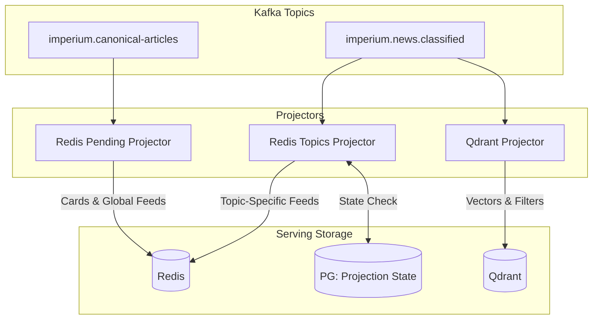

# Storage Stage: Projections & Schemas

The Storage Stage projects processed events into specialized data stores optimized for different access patterns: durability (PostgreSQL), low-latency feed serving (Redis), and semantic retrieval (Qdrant).

## Architecture Diagram


## Architecture & Flow



## Data Stores and Projections

### 1. PostgreSQL (System of Record)
PostgreSQL remains the source of truth for all article metadata.
- **Canonical Articles**: Stores the full history and current state of every article.
- **Projection State**: A specialized table that tracks which article versions have been projected to Redis and Qdrant. This ensures that updates (e.g., reclassification) correctly clean up old memberships in Redis.

### 2. Redis (Serving Layer)
Redis is optimized for sub-millisecond retrieval of news feeds and article cards.
- **Article Cards**: `article:{article_id}` (Hash). Stores compact metadata (title, image URL, source) needed to render a feed item without a database hit.
- **Sorted Set Feeds**: Articles are indexed in sorted sets scored by `published_at` (timestamp).
    - `feed:global`: All visible articles.
    - `feed:country:{country_id}`: Articles filtered by country.
    - `feed:topic:{root_topic_id}`: Articles filtered by their primary root topic.
    - `feed:country:{country_id}:topic:{root_topic_id}`: Cross-filtered feeds.
- **Cleanup**: The Topics Projector uses the "Projection State" to remove an article from its previous topic feeds when it is reclassified.

### 3. Qdrant (Vector Layer)
Qdrant provides semantic search and hybrid filtering capabilities.
- **Collection**: A single `news_articles` collection.
- **Vectors**: 1024-dimensional embeddings (from `baai/bge-m3`).
- **Payload Filters**: Every point includes a metadata payload for high-performance filtering:
    - `article_id`: UUID
    - `country_id`, `root_topic_id`, `language_id`: Integer IDs
    - `published_at`: Timestamp (for "recent articles" vector search)
    - `is_visible`: Boolean
    - `source_domain`: String

## Projection Logic
- **Isolation**: Each projector runs as an independent Spark job. A failure in the Qdrant projector does not block Redis updates.
- **Idempotency**: Projectors check the "Projection State" to skip redundant work if the article version has already been successfully projected.
- **Latency**: Redis projections typically complete within seconds of the article being "pending", while topic and Qdrant projections wait for the classification step to finish.

## Data Retention & TTL Policies

| Layer | Component | Retention / TTL | Strategy |
|---|---|---|---|
| **Kafka** | `canonical-articles` | Bounded (Compact) | Keep latest version per article ID |
| **Kafka** | `raw.*` | 7 Days (Delete) | Temporary buffer for re-processing |
| **Redis** | Article Cards | No TTL | Managed by pipeline (deleted on `is_deleted` event) |
| **Redis** | Viewed Logs | 12 Days | Automatic expiration to refresh user feed |
| **Redis** | Metadata Cache | 24 Hours | Cache-aside for full article details |
| **Qdrant** | Vectors | No TTL | Persistent for semantic search |

## Idempotency & Projection State

To handle Kafka replays and updates (e.g., reclassification) safely, the **Projection State** repository in PostgreSQL tracks:
- `article_id`: Primary key.
- `country_id`: Used to clean up old country-specific feeds in Redis.
- `root_topic_id`: Used to clean up old topic-specific feeds in Redis.
- `version/timestamp`: Used to detect and skip exact duplicate replays.

This state-aware fan-out ensures that if an article moves from "Science" to "Technology", the system automatically performs an `SREM` on the Science feed and an `SADD` on the Technology feed in Redis.

## Static Architecture Diagram (Python)

The following Python code uses the `diagrams` library to generate a high-resolution architecture diagram for this stage.

```python
from diagrams import Diagram, Cluster, Edge
from diagrams.onprem.database import PostgreSQL
from diagrams.onprem.queue import Kafka
from diagrams.onprem.inmemory import Redis
from diagrams.onprem.compute import Spark
from diagrams.onprem.search import Solr 

with Diagram("Storage Stage Architecture", show=False, filename="storage_arch", direction="LR"):
    kafka_topics = Kafka("Canonical & Classified\nTopics")
    
    with Cluster("Projectors (Spark)"):
        redis_proj = Spark("Redis Projectors\n(Pending & Topics)")
        qdrant_proj = Spark("Qdrant Projector")
        
    with Cluster("Serving Layer"):
        redis = Redis("Redis\n(Feeds & Cards)")
        qdrant = Solr("Qdrant\n(Vectors)")
        pg_state = PostgreSQL("PG: Projection\nState")

    kafka_topics >> redis_proj
    kafka_topics >> qdrant_proj
    
    redis_proj >> redis
    redis_proj >> pg_state
    qdrant_proj >> qdrant
```

> [!NOTE]
> To run this script, you need to install the `diagrams` library (`pip install diagrams`) and have **Graphviz** installed on your system.
