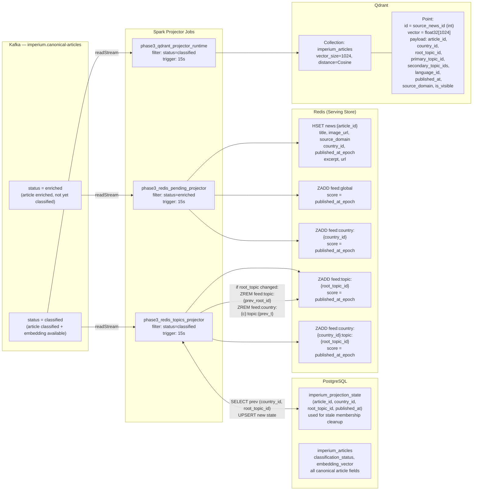

# Storage Stage: Projections & Schemas

The Storage Stage projects `CanonicalArticle` records into three specialized stores: **Redis** (feed ZSETs + article card hashes for low-latency serving), **Qdrant** (1024-dim BGE-M3 vectors for semantic search), and **PostgreSQL** (canonical state + projection tracking for replay safety).

**Data enters** as JSON `CanonicalArticle` records from the `imperium.canonical-articles` Kafka topic.  
**Data leaves** via direct writes to Redis, Qdrant, and PostgreSQL. No data is emitted to Kafka from this stage.

← Previous stage: [Processing](../processing/README.md) — produces the CanonicalArticle events consumed here.  
→ Next stage: [Backend](../backend/README.md) — reads Redis ZSETs and Qdrant written by this stage.

---

## Architecture & Flow


```mermaid
flowchart LR
    subgraph KAFKA["Kafka — imperium.canonical-articles"]
        T_ENRICH["status = enriched\n(article enriched, not yet classified)"]
        T_CLASSIF["status = classified\n(article classified + embedding available)"]
    end

    subgraph PROJ["Spark Projector Jobs"]
        RP_P["phase3_redis_pending_projector\nfilter: status=enriched\ntrigger: 15s"]
        RP_T["phase3_redis_topics_projector\nfilter: status=classified\ntrigger: 15s"]
        QP["phase3_qdrant_projector_runtime\nfilter: status=classified\ntrigger: 15s"]
    end

    subgraph PG["PostgreSQL"]
        PS["imperium_projection_state\n(article_id, country_id, root_topic_id, published_at)\nused for stale membership cleanup"]
        ART["imperium_articles\nclassification_status, embedding_vector\nall canonical article fields"]
    end

    subgraph REDIS["Redis (Serving Store)"]
        H["HSET news:{article_id}\ntitle, image_url, source_domain\ncountry_id, published_at_epoch\nexcerpt, url"]
        ZG["ZADD feed:global\nscore = published_at_epoch"]
        ZC["ZADD feed:country:{country_id}\nscore = published_at_epoch"]
        ZT["ZADD feed:topic:{root_topic_id}\nscore = published_at_epoch"]
        ZCT["ZADD feed:country:{country_id}:topic:{root_topic_id}\nscore = published_at_epoch"]
    end

    subgraph QDRANT["Qdrant"]
        COL["Collection: imperium_articles\nvector_size=1024, distance=Cosine"]
        PT["Point:\n  id = source_news_id (int)\n  vector = float32[1024]\n  payload: article_id, country_id,\n  root_topic_id, primary_topic_id,\n  secondary_topic_ids, language_id,\n  published_at, source_domain, is_visible"]
    end

    T_ENRICH -->|readStream| RP_P
    T_CLASSIF -->|readStream| RP_T
    T_CLASSIF -->|readStream| QP

    RP_P --> H
    RP_P --> ZG
    RP_P --> ZC

    RP_T --> ZT
    RP_T --> ZCT
    RP_T -->|"if root_topic changed:\nZREM feed:topic:{prev_root_id}\nZREM feed:country:{c}:topic:{prev_t}"| ZT
    RP_T <-->|"SELECT prev (country_id, root_topic_id)\nUPSERT new state"| PS

    QP --> COL
    COL --- PT
```

---

## Redis Key Reference

> **Note on key prefix:** The Python pipeline writes article card hashes under the key prefix `news:` (e.g. `news:{article_id}`). The backend reads these using `Constants.KEY_NEWS_HASH` in `Constants.java`. Both must stay in sync — any change to the prefix requires updating `redis_projection.py` **and** `Constants.java`.

| Key Pattern | Type | Score / TTL | Written By | Read By | Purpose |
|---|---|---|---|---|---|
| `news:{article_id}` | Hash | no TTL | [`redis_projection.py`](../../../apps/processing/news-pipeline/src/imperium_news_pipeline/phase3/redis_projection.py) | [`FeedRepository.java`](../../../backend/news-app/src/main/java/solutions/imperium/news_api/domain/feed/FeedRepository.java) | Article card: title, image_url, source_domain, published_at, country_id, excerpt, url |
| `feed:global` | ZSET | score=published_at epoch | [`redis_projection.py`](../../../apps/processing/news-pipeline/src/imperium_news_pipeline/phase3/redis_projection.py) | [`FeedRepository.java`](../../../backend/news-app/src/main/java/solutions/imperium/news_api/domain/feed/FeedRepository.java) | All visible articles; global feed fallback |
| `feed:country:{country_id}` | ZSET | score=published_at epoch | [`redis_projection.py`](../../../apps/processing/news-pipeline/src/imperium_news_pipeline/phase3/redis_projection.py) | [`FeedRepository.java`](../../../backend/news-app/src/main/java/solutions/imperium/news_api/domain/feed/FeedRepository.java) | Country-filtered feed; Phase 2 fallback |
| `feed:topic:{root_topic_id}` | ZSET | score=published_at epoch | [`redis_projection.py`](../../../apps/processing/news-pipeline/src/imperium_news_pipeline/phase3/redis_projection.py) | [`FeedRepository.java`](../../../backend/news-app/src/main/java/solutions/imperium/news_api/domain/feed/FeedRepository.java) | Topic-filtered global feed |
| `feed:country:{c}:topic:{t}` | ZSET | score=published_at epoch | [`redis_projection.py`](../../../apps/processing/news-pipeline/src/imperium_news_pipeline/phase3/redis_projection.py) | [`FeedRepository.java`](../../../backend/news-app/src/main/java/solutions/imperium/news_api/domain/feed/FeedRepository.java) | Primary personalized feed query (Phase 1) |
| `user:{id}:prefs` | Hash | no TTL | [`UserService.java`](../../../backend/news-app/src/main/java/solutions/imperium/news_api/domain/user/UserService.java) | [`FeedService.java`](../../../backend/news-app/src/main/java/solutions/imperium/news_api/domain/feed/FeedService.java) | User preferences: `country_id`, `topic_ids[]` |
| `user:{id}:viewed` | Set | 12-day TTL | [`FeedService.java`](../../../backend/news-app/src/main/java/solutions/imperium/news_api/domain/feed/FeedService.java) | [`FeedService.java`](../../../backend/news-app/src/main/java/solutions/imperium/news_api/domain/feed/FeedService.java) | Seen article IDs for deduplication |
| `user:{id}:saved` | Set | no TTL | [`ArticleService.java`](../../../backend/news-app/src/main/java/solutions/imperium/news_api/domain/article/ArticleService.java) | [`ArticleService.java`](../../../backend/news-app/src/main/java/solutions/imperium/news_api/domain/article/ArticleService.java) | Bookmarked articles |
| `article:{id}` | String (JSON) | 24h TTL | [`ArticleService.java`](../../../backend/news-app/src/main/java/solutions/imperium/news_api/domain/article/ArticleService.java) | [`ArticleService.java`](../../../backend/news-app/src/main/java/solutions/imperium/news_api/domain/article/ArticleService.java) | Full article detail cache (cache-aside with PG fallback) |
| `topics:list` | String (JSON) | cache | [`TopicService.java`](../../../backend/news-app/src/main/java/solutions/imperium/news_api/domain/topic/TopicService.java) | `TopicController.java` | Cached topic taxonomy list |
| `countries:list` | String (JSON) | cache | `CountryService.java` | — | Cached country list |

---

## PostgreSQL Tables

| Table | Written By | Purpose |
|---|---|---|
| `imperium_articles` | Canonical Emit + Classification jobs | Full canonical article storage with all metadata, embedding, classification status |
| `imperium_projection_state` | Redis Topics Projector | Tracks per-article `(country_id, root_topic_id)` to enable stale membership cleanup on reclassification |
| `imperium_dim_links` | Dimension Materializer | Curated link/source metadata |
| `imperium_dim_authorities` | Dimension Materializer | Publishing authority metadata |
| `imperium_dim_seditions` | Dimension Materializer | Media edition metadata |
| `imperium_dim_countries` | Dimension Materializer | Country metadata |
| `imperium_dim_rubrics` | Dimension Materializer | Topic rubric metadata |
| `imperium_dim_languages` | Dimension Materializer | Language metadata |
| `imperium_topic_taxonomy` | `topic_bootstrap.py` (startup) | Topic tree loaded from Medtop taxonomy JSON |
| `imperium_topic_embeddings` | `phase3_topic_embedding_refresh.py` | Active topic vectors; regenerated when topic SHA-256 hash changes |

Full DDL: [`resources/schema/imperium_news_articles.sql`](../../../apps/processing/news-pipeline/resources/schema/imperium_news_articles.sql)

---

## Qdrant Collection Schema

Collection: `imperium_articles`

| Field | Type | Description |
|---|---|---|
| `id` | `uint` | `source_news_id` (integer, from `table_news.id`) |
| `vector` | `float32[1024]` | BGE-M3 article embedding |
| `payload.article_id` | UUID string | Canonical article identifier |
| `payload.country_id` | integer | Source country |
| `payload.root_topic_id` | integer | Root-level topic classification |
| `payload.primary_topic_id` | integer | Leaf topic classification |
| `payload.secondary_topic_ids` | integer[] | Additional topic candidates |
| `payload.topic_tags` | string[] | Human-readable topic labels |
| `payload.authority_id` | integer | Publishing authority |
| `payload.language_id` | integer | Article language |
| `payload.rubric_id` | integer | Source rubric |
| `payload.published_at` | integer (epoch) | Publication timestamp; used for recency filtering |
| `payload.source_domain` | string | Source website domain |
| `payload.is_visible` | boolean | Visibility flag |

Qdrant write implementation: [`qdrant_projection.py`](../../../apps/processing/news-pipeline/src/imperium_news_pipeline/phase3/qdrant_projection.py) (uses `urllib` directly, no SDK dependency).

---

## Key Source Files

| File | Description |
|---|---|
| [`phase3/redis_projection.py`](../../../apps/processing/news-pipeline/src/imperium_news_pipeline/phase3/redis_projection.py) | `RedisFeedProjector`; writes all Redis keys listed above |
| [`phase3/qdrant_projection.py`](../../../apps/processing/news-pipeline/src/imperium_news_pipeline/phase3/qdrant_projection.py) | `QdrantArticleProjector`; builds Qdrant point and upserts via HTTP |
| [`phase3/projection_fanout.py`](../../../apps/processing/news-pipeline/src/imperium_news_pipeline/phase3/projection_fanout.py) | `ProjectionFanout`; runs Redis + Qdrant projectors independently; skips exact replays; persists new state only when both succeed |
| [`phase3/projection_state.py`](../../../apps/processing/news-pipeline/src/imperium_news_pipeline/phase3/projection_state.py) | `ProjectionStateRepository`; PostgreSQL-backed; stores prior `(country_id, root_topic_id)` for stale ZSET cleanup |
| [`backend/news-app/src/main/java/solutions/imperium/news_api/core/Constants.java`](../../../backend/news-app/src/main/java/solutions/imperium/news_api/core/Constants.java) | Canonical Redis key constants used by the backend — must stay in sync with `redis_projection.py` |

---

## Data Retention & TTL Policies

| Layer | Component | Retention / TTL | Strategy |
|---|---|---|---|
| **Kafka** | `imperium.canonical-articles` | Compacted | Keep latest CanonicalArticle per article ID |
| **Kafka** | `imperium.news.public.*` (raw CDC) | 7 days (delete) | Temporary replay buffer |
| **Redis** | Article cards (`news:{id}`) | No TTL | Deleted by pipeline on `is_deleted` event |
| **Redis** | Feed ZSETs | No TTL | Entries removed on reclassification via projection state |
| **Redis** | Viewed log (`user:{id}:viewed`) | 12 days | Automatic expiry to refresh personalization |
| **Redis** | Article detail cache (`article:{id}`) | 24 hours | Cache-aside TTL |
| **Qdrant** | Vectors | No TTL | Persistent; overwritten on reclassification upsert |

---

## Idempotency: Projection Fanout Flow

```
ProjectionFanout.project(article):
  1. SELECT ProjectionState WHERE article_id = article.article_id
  2. IF stored_state.matches(article)  →  SKIP (exact replay)
  3. ELSE:
     a. prev_country_id   = stored_state.country_id   (for stale ZREM)
     b. prev_root_topic_id = stored_state.root_topic_id
     c. Run RedisFeedProjector (failure-isolated)
     d. Run QdrantArticleProjector (failure-isolated)
     e. UPSERT ProjectionState with new (country_id, root_topic_id)
        → only persists if both projectors succeed
```

Source: [`projection_fanout.py`](../../../apps/processing/news-pipeline/src/imperium_news_pipeline/phase3/projection_fanout.py)
