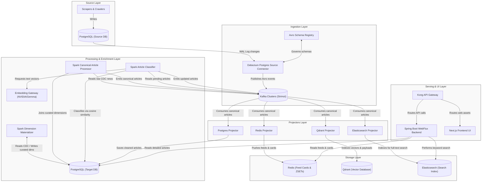
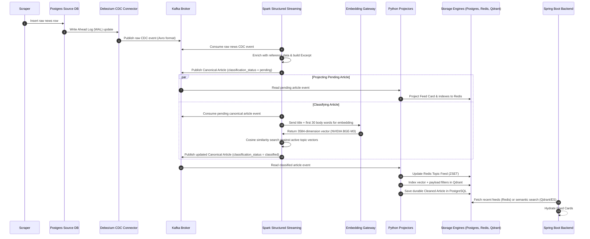

# 01 - Overview and System Architecture

## 1. Project Context & Objectives

The **Imperium News Streaming Platform** is a modern, real-time, event-driven intelligence system designed for news ingestion, enrichment, storage, and serving. In modern news publishing and intelligence environments, latency, content quality, semantic search, and highly personalized experiences are critical competitive factors. 

The primary objective of the Imperium platform is to replace a legacy, database-centric CRUD architecture with a highly scalable, real-time, event-driven stream processing pipeline. This pipeline converts raw scraped news updates into enriched, classified, and indexed content ready for low-latency serving on web and mobile client interfaces.

---

## 2. Problem Statement (Legacy vs. Modern)

In the legacy architecture of the Imperium platform, PostgreSQL functioned as a monolithic system of record and query engine. It was concurrently responsible for:
1.  **Ingestion:** Accepting raw, high-throughput inserts from scraping and crawling services.
2.  **Processing & Normalization:** Running periodic batch SQL scripts to clean text, resolve dimensions, and categorize content.
3.  **Serving:** Processing complex relational queries, joins, and aggregates for user feeds and search interfaces.

### Consequences of the Monolithic DB Approach
*   **Database Contention:** High-write lock contention from scraping workers blocked or severely degraded read performance for user-facing feed queries.
*   **High Latency:** Complex SQL joins across millions of articles to generate localized and topic-specific feeds resulted in poor response times (typically several seconds under moderate user loads).
*   **Scalability Bottlenecks:** Scaling a relational database vertically to support concurrent write/read spikes is economically and architecturally unsustainable.
*   **Lack of Real-Time Flow:** Category matching and enrichment occurred in scheduled batch intervals, meaning newly scraped news did not appear on user feeds in real-time.
*   **No Semantic Context:** Keyword-only queries could not capture the thematic or conceptual meaning of articles.

### 2.1 Core Architectural Principles: CQRS and Event Sourcing
To scale to millions of active news records or social media posts under high-frequency writes (from crawling bots and scraping microservices) while keeping client serving latency within **50-500ms**, the system is designed around two core patterns:

1.  **CQRS (Command Query Responsibility Segregation):**
    *   **The Command Path (Writes):** Writing is handled exclusively in the source relational database by the scrapers. It is optimized for transactions and rapid inserts.
    *   **The Query Path (Reads):** Client APIs query read-optimized projection stores (Redis for feeds, Elasticsearch for search, and Qdrant for vector search) rather than Postgres. These stores are populated asynchronously. This segregates read and write responsibilities, completely removing relational joins and lock contentions.
2.  **Event Sourcing via Change Data Capture (CDC):**
    *   Instead of polling the database, the system treats database changes as an immutable stream of write commands.
    *   By decoding the Postgres Write-Ahead Log (WAL) with Debezium, every INSERT, UPDATE, and DELETE is captured as an event and appended to a Kafka topic. These events serve as the single, replay-safe source of truth for all downstream projections.

---

## 3. High-Level System Architecture

The modern architecture separates concerns into distinct layers: Ingestion, Processing, Storage, and Serving. It is built as a fully decoupled, event-driven streaming topology deployed on Kubernetes.

---

## 4. Platform Data Flow

The lifecyle of an article flows asynchronously through six major stages:

---

## 5. Domain Ubiquitous Language

To ensure communication integrity across data engineering, software engineering, and operations, the following terminology is strictly enforced:

*   **Raw News Record:** A source PostgreSQL news row captured through CDC before cleaning, normalization, or enrichment.
*   **Canonical Article:** The stable event contract emitted by processing and consumed by serving projectors. This is the primary boundary contract between processing and storage/serving.
*   **Cleaned Article:** The durable, long-term PostgreSQL article record stored after cleaning, enrichment, and metadata resolution.
*   **Article ID:** The deterministic platform-wide identifier for a canonical article, formatted as `news:{source_news_id}`.
*   **Source News ID:** The original auto-incremented primary key of the news row in the source database.
*   **Excerpt:** The deterministic short text snippet (first 30 clean words) derived from the cleaned body text for feed cards.
*   **Topic Taxonomy:** The hierarchical business topic tree stored as the source of truth in PostgreSQL.
*   **Primary Topic:** The selected leaf topic assigned to an article by the embedding similarity classifier.
*   **Root Topic:** The top-level parent category derived from the primary topic using the topic taxonomy configuration.
*   **Topic Embedding:** The precomputed vector representation of a topic's metadata used for similarity matching.
*   **Projector:** An independent service that consumes canonical article events and writes serving projections to target data stores.
*   **Feed Card:** The compact JSON hash stored in Redis used to render feeds without fetching full article bodies.
*   **Feed Index:** A Redis Sorted Set (ZSET) containing only Article IDs scored by publication timestamps.
*   **Vector Projection:** The Qdrant point containing the article embedding and filtering payloads.
